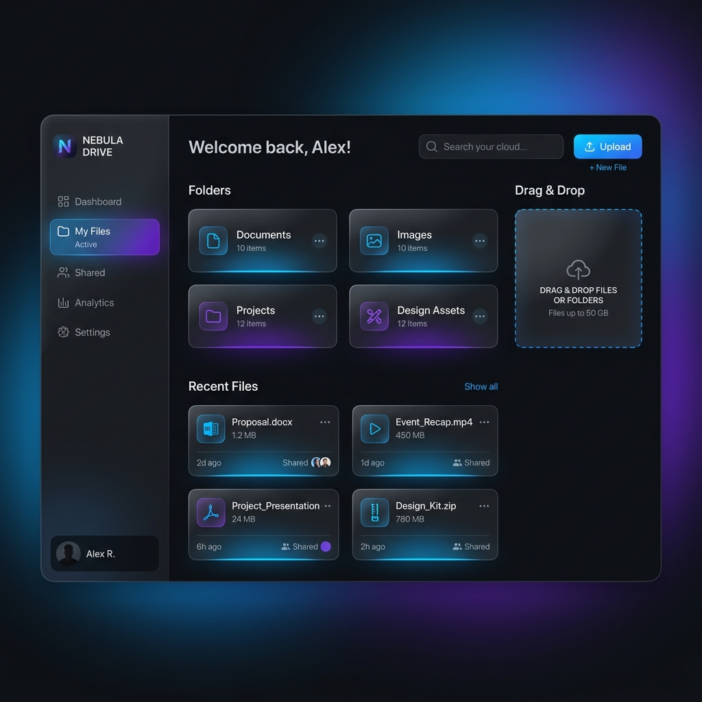
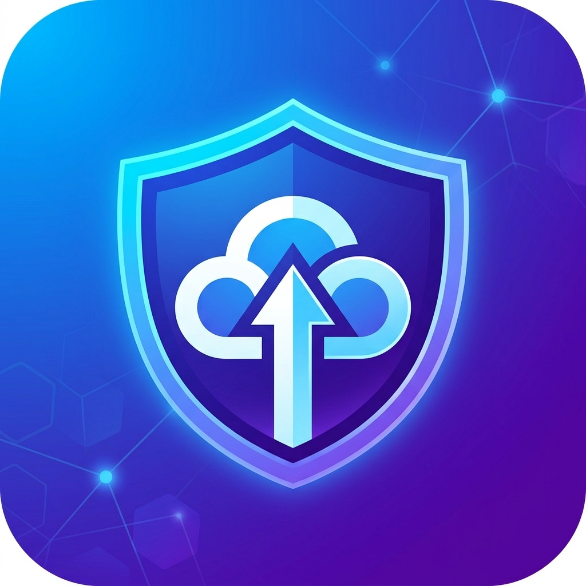

# 🚀 FileSharing: Next-Generation Cloud Storage & Sharing



## ✨ Overview
**FileSharing** is a premium, high-performance web platform built with **ASP.NET Core 10** and **C# 12**. Designed with a focus on **modern aesthetics** and **clean architecture**, it provides a seamless experience for users to securely upload, browse, search, and download files. 

The application utilizes industry-standard practices, including **Service-Oriented Architecture**, **FluentValidation**, and a **Repository-inspired service layer**.

---

## 🛠️ Tech Stack & Architecture

- **Core Framework**: `.NET 10 (ASP.NET Core MVC)`
- **Programming Language**: `C# 12`
- **Database**: `Entity Framework Core (SQL Server)`
- **Identity & Security**: `ASP.NET Core Identity`, `Google Auth`, `Facebook Auth`
- **Validation**: `FluentValidation` (Automated Pipeline)
- **UI & Aesthetics**: `Bootstrap 5`, `Glassmorphism`, `Animate.css`, `Google Fonts`
- **Dependency Injection**: Refactored into specialized extension methods for clean `Program.cs`.
- **Infrastructure**: Automated database migrations on startup.

---

## 🌟 Key Features

- **📂 Secure File Management**: Optimized file storage with unique filename generation and extension whitelisting.
- **🔍 Advanced Search**: Instant search capabilities to browse through community-shared content.
- **🔐 Robust Authentication**: Secure registration and login with local accounts or external providers (Google, Facebook).
- **🛡️ Identity Integration**: Full account management, including password changes and role-based seeding.
- **⚡ Performance Tracking**: Atomic download count incrementation using EF Core `ExecuteUpdateAsync`.
- **✉️ Async Communications**: Fully asynchronous SMTP mail services with structured logging.
- **🎨 Premium UI/UX**: Dark-themed, modern interface with smooth micro-animations and responsive design.

---

## 🚀 Getting Started

### Prerequisites

- **.NET 10 SDK**
- **SQL Server LocalDB** or a dedicated instance.
- Visual Studio 2022 (Latest) or VS Code.

### Installation

1. **Clone the repository:**
   ```bash
   git clone https://github.com/AhmedIbrahim-tech/Filesharing.git
   ```

2. **Configure Database:**
   Update the `DefaultConnection` in `appsettings.json` to point to your SQL Server instance.
   ```json
   "ConnectionStrings": {
     "DefaultConnection": "Server=(localdb)\\mssqllocaldb;Database=FileSharingDB;..."
   }
   ```

3. **Run Migrations & Seed Data:**
   The application automatically runs migrations and seeds the **Super Admin** account on startup.
   - **Admin User**: `admin@filesharing.com`
   - **Password**: `Admin@123`

4. **Run the App:**
   ```bash
   dotnet watch run
   ```

---

## 📸 Platform Peek

<p align="center">
  <br>
  <b>Premium Experience</b>
</p>

- **Modern Hero Section**: High-impact visuals with interactive search.
- **File Cards**: Rich metadata display with glassmorphism effects.
- **Responsive Navigation**: Adaptive header with localization support (En/Ar).

---

## 👨‍💻 Contributing
This project is an open showcase for professional .NET development. Feel free to fork, explore, and submit pull requests!

---

**Developed with ❤️ by [Ahmed Ibrahim](https://github.com/AhmedIbrahim-tech)**
